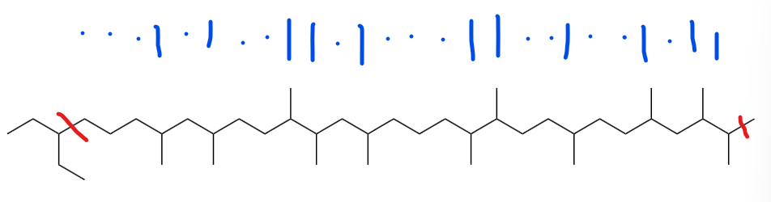

# Alkane_code烷烃密码

​	**Alkane(烷烃)** 是一类有机化合物，分子中的碳原子都以碳碳单键相连，其余的价键都与氢结合而成的化合物，这里以链烷烃为例展示一种基于烷烃类物质结构的编码方式。

### 一、编码设计

​	为了避免过长的支链支链和主链发生交换，编码中最长的支链为一个 *CH~3~* （甲基）。因此，本项目使用二进制编码，一个 **C** 分子节点上无甲基为 *0* ，有甲基为 *1* 。为了确定阅读顺序，在起始端追加如下结构：

​	同时在链末尾追加一个甲基，防止二进制编码末位为1时产生的歧义。

### 二、程序功能

​	程序在input之后会生成输入文字对应的 **二进制编码** 、生成的烷烃的 **名字** 和该烷烃的`.mol`文件 *(文件默认命名为：`输入内容_烷.mol`)* 。烷烃使用中文命名，碳链最长为99999，超过此数值中文命名将不再正确，可参照后面阿拉伯数字。 *(真超了99999说明你输入的内容实在过长，可以考虑分开输入，毕竟大部分软件也无法处理如此长的烷烃)*

​	程序只考虑编码，不考虑解码 *(我正在尝试读`.mol`文件并让程序理解它，这个功能可能在日后进行更新)* ，这里教学一下人工读码方法：

​	如图所示，有甲基为 *1* ，无为 *0* ，从乙基开始向另一端读取，舍弃最后一个甲基，得到二进制编码：`00010100110100011001001011` 。该编码默认补全0，长度是4的倍数，以utf-8进行解码可以得到输入的文字。本程序编写时 ***(byteorder='big')*** 如果要转成byte后decode请记得将byteorder设为big。

### 三、写给开发者

​	程序没有做封装，因为我们认为一个小脚本犯不着这么做，您若有兴趣可以封装一下，本组织还有同类项目：https://github.com/SFKgroup/polypeptide-translator 为肽链的编码，有兴趣的话可以了解一下。

​	项目里面还有一个烯烃编码的程序，使用碳碳双键和单键编码，由于会出现较长的积累多烯烃这种几乎无法存在的结构 *(就是无法存在)* ，因此作为废案。如果要将全部积累烯烃转化为共轭烯烃，编码效率过低，如对这个编码有兴趣或改进意见的可以发issue和我们交流。

